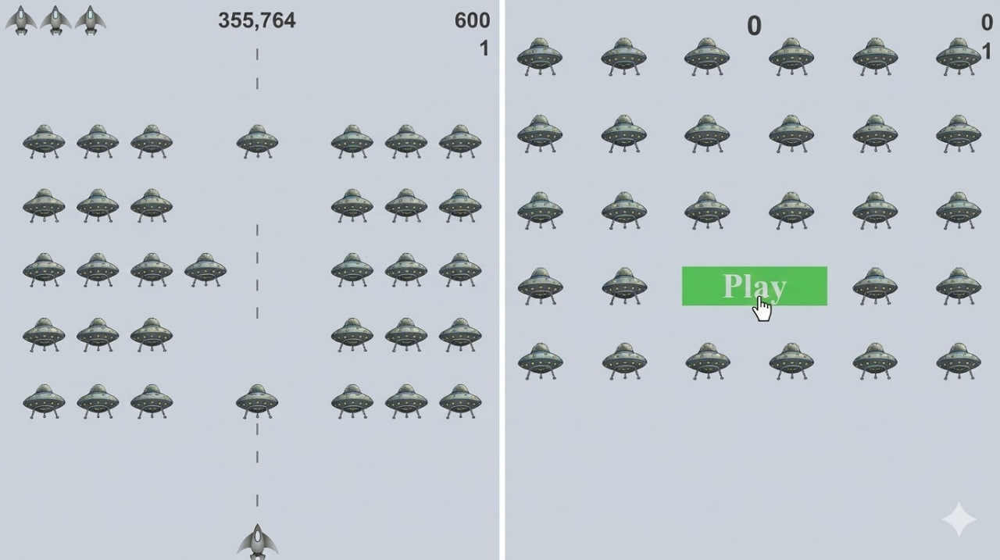

# Alien Invasion

[Installation](#installation) · [Usage](#usage) · [Features](#features) · [Configuration](#configuration) · [Project Structure](#project-structure) · [Tests](#tests)

Alien Invasion is a simple arcade-style space shooter built with Python and `pygame`. You control a ship at the bottom of the screen, fire bullets at descending aliens, clear waves, and survive as the game gets faster with each level.

## Description

This project is a desktop game inspired by classic alien shooter games. The player can move left and right, shoot enemies, track score and level progress, and restart the game using the on-screen Play button or keyboard controls.

## Screenshot



`images/allinone.jpg`


## Table of Contents

- [Description](#description)
- [Screenshot](#screenshot)
- [Installation](#installation)
- [Usage](#usage)
- [Controls](#controls)
- [Features](#features)
- [Configuration](#configuration)
- [Project Structure](#project-structure)
- [Contributing](#contributing)
- [Tests](#tests)
- [License](#license)
- [Contact / Credits](#contact--credits)

## Installation

1. Clone the repository:

   ```bash
   git clone <https://github.com/samiZZZ67/Alien-Invasion.git>
   cd "Alien Invasion"
   ```

2. Create and activate a virtual environment if you want an isolated setup:

   ```powershell
   python -m venv venv
   .\venv\Scripts\Activate.ps1
   ```

3. Install the required dependency:

   ```powershell
   pip install pygame
   ```

## Usage

Run the game from the project folder:

```powershell
python alien_invasion.py
```

When the game opens:
- Press `P` to start a new game
- Or click the `Play` button with your mouse
- Use the keyboard to move and shoot
- Press `Q` to quit

## Controls

- `Left Arrow` — move ship left
- `Right Arrow` — move ship right
- `Space` — fire bullets
- `P` — start a new game
- `Q` — quit the game
- `Mouse Click` on `Play` — start the game from the menu screen

## Features

- Fullscreen `pygame` game window
- Player-controlled spaceship movement
- Bullet shooting with a limited number of bullets on screen
- Alien fleet generation across multiple rows
- Collision detection between bullets and aliens
- Score tracking, high score display, level display, and remaining lives
- Difficulty progression with faster ships, bullets, and aliens each level
- Restart support through keyboard or on-screen Play button

## Configuration

The main game settings are stored in `settings.py`.

Current configurable values include:
- Screen size defaults to `1200 x 800` before fullscreen adjusts to the current display
- Background color is `RGB(230, 230, 230)`
- Ship lives limit is `3`
- Bullet width is `3`
- Bullet height is `15`
- Bullet color is `RGB(60, 60, 60)`
- Maximum bullets allowed at once is `3`
- Fleet drop speed is `1.5`
- Speed increase multiplier is `1.1`
- Score increase multiplier is `1.5`
- Starting alien points are `50`

If you want to change game difficulty or balance, edit:

- `ship_speed`
- `bullet_speed`
- `alien_speed`
- `bullets_allowed`
- `ship_limit`
- `speedup_scale`
- `score_scale`
- `alien_points`

## Project Structure

This project is built around 8 Python source files:

```text
Alien Invasion/
├── alien_invasion.py   # Main game loop and overall controller
├── settings.py         # Game configuration and difficulty scaling
├── ship.py             # Player ship behavior and rendering
├── bullet.py           # Bullet creation, movement, and drawing
├── alien.py            # Alien sprite behavior and movement
├── button.py           # Play button UI
├── game_stats.py       # Score, level, lives, and game state
├── scoreboard.py       # Scoreboard and HUD rendering
├── images/
│   ├── ship.bmp        # Ship image asset
│   └── alien.bmp       # Alien image asset
├── README.md
└── venv/               # Local virtual environment (optional)
```

### File Summary

- `alien_invasion.py` manages initialization, the main loop, input handling, bullets, aliens, collision handling, fleet creation, and screen updates.
- `settings.py` stores static and dynamic settings such as speed, scoring, bullet limits, and scaling rules.
- `ship.py` loads the ship image, updates movement, and keeps the ship centered when needed.
- `bullet.py` creates bullets, moves them upward, and draws them to the screen.
- `alien.py` defines each alien, including edge detection and horizontal movement.
- `button.py` draws the Play button shown when the game is inactive.
- `game_stats.py` tracks score, level, remaining ships, high score, and active/inactive game state.
- `scoreboard.py` renders the score, high score, level, and ship icons for remaining lives.

## Contributing

If you want to contribute to this project:

1. Fork the repository
2. Create a new branch for your feature or fix
3. Make your changes
4. Test the game manually
5. Submit a pull request with a clear description

Good contribution ideas:
- Add sound effects or background music
- Add a start menu or pause screen
- Save the high score to a file
- Add explosion effects or animations
- Add automated tests for logic that does not depend on rendering

## Tests

There are currently no automated tests included in this project.

For now, you can test manually by running:

```powershell
python alien_invasion.py
```

Manual test checklist:
- Confirm the game window opens correctly
- Confirm the `Play` button starts a new game
- Confirm the ship moves left and right
- Confirm bullets fire with `Space`
- Confirm bullets remove aliens on collision
- Confirm score and level increase correctly
- Confirm lives decrease when the ship is hit
- Confirm `Q` closes the game

## License

No license file is currently included in this project.

If you want to open-source it, a common choice is the `MIT` license.

## Contact / Credits

- Project: `Alien Invasion`
- Built with: Python and `pygame`
- Author: Samuel Firegedil, abiyafikre@gmail.com

